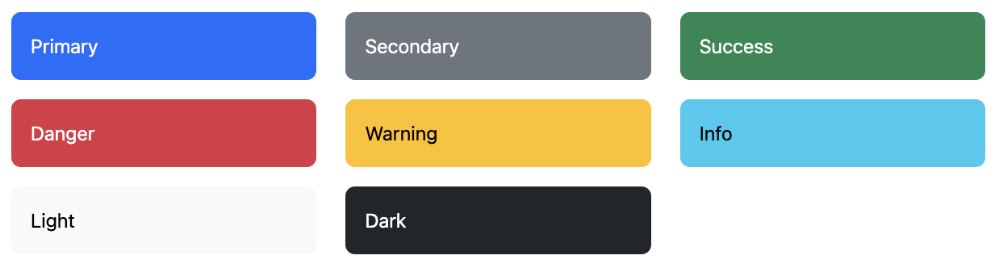
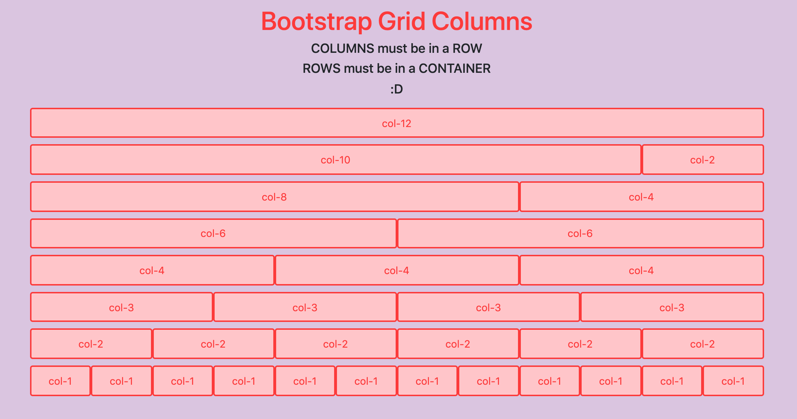

## Table of Contents
{: .no_toc .text-delta }

{: .fs-2 }
- TOC
{:toc}

---
#### New Unit! Use a GitHub Template for class notes:
{:.no_toc}

<div class="setup" markdown="block">

1. Go to the public template **repository** for our class: [BWL-CS HTML/CSS/JS Template](https://github.com/BWL-CS/html-css-js-template)
2. Click the <button type="button" name="button" class="btn btn-green">Use this template</button> button above the list of files then select `Create a new repository`
3. Specify the **repository name**: `CS1-Unit-3-Notes` or `CS1-Bootstrap-Notes`
4. Click <button type="button" name="button" class="btn btn-green">Create repository</button>
    > Now you have **your own personal copy** of this starter code that you can always access under the `Your repositories` section of GitHub! 
5. Now on your repository, click <button type="button" name="button" class="btn btn-green"> < > Code </button> and select the `Codespaces` tab
6. Click `Create Codespace on main` and wait for the environment to load, _then you're ready to code_!
7. 📝 Take notes in this Codespace during class, coding along with the instructor.

</div>

---

## Developing Responsive Websites

🥾 Bootstrap is a popular _front-end framework_ for developing **responsive** and **mobile-first** websites. 


<html>
<dl>
  <dt>Responsive</dt>
  <dd>Websites that <strong>automatically scale</strong> between devices — whether the device is a mobile phone, tablet, laptop, desktop computer, screen reader, etc.</dd>
</dl>
</html>

<html>
<dl>
  <dt>Mobile-First</dt>
  <dd>Websites that are primarily designed for mobile devices, then scales up from there (as opposed to being designed first for desktop, then trying to scale it down to mobile devices)</dd>
</dl>
</html>

### What is Bootstrap?
{:.no_toc} 

Bootstrap provides a collection of `CSS` classes and JavaScript-based design templates for **layout**, **typography**, **forms**, **buttons**, **navigation**, and other reusable webpage **components**. You are free to use whichever Bootstrap components you choose, while adding your own on top! There are thousands of websites out there that are built on Bootstrap, but with their own customizations.

Bootstrap can be used to build websites of any scale, from small blogs to large corporate websites. Organizations that use Bootstrap include [NASA](https://www.nasa.gov/), [FIFA](https://www.fifa.com/en), [Newsweek](https://www.newsweek.com/), [VOGUE](https://www.vogue.com/) and many more.

#### Why Use Bootstrap?
{:.no_toc} 
* **Ease of Use:** Prebuilt CSS styles and components.
* **Responsiveness:** Automatic adjustment to different screen sizes.
* **Consistency:** Uniform design across devices and browsers.
* **Customizability:** Override or extend styles as needed.
* **Fast Development:** Reusable components save time.

### Installing Bootstrap 5 via CDN Link

The simplest way to load/use Bootstrap is by including its **CDN link** in your HTML file. 

📥 A **CDN** (**C**ontent **D**elivery **N**etwork) is a distributed network of servers strategically located in different parts of the world to deliver content, such as files, images, and scripts, to users faster and more reliably.

1. Include the CDN link to Bootstrap's CSS code in the `<head>` section:
    ```html
    
        <!-- Bootstrap CSS -->
        <link href="https://cdn.jsdelivr.net/npm/bootstrap@5.3.3/dist/css/bootstrap.min.css" rel="stylesheet">
     
    ```
1. To use interactive elements like **carousels** (slideshows) and **modals** (pop-up windows), include the CDN link to Bootstrap's JavaScript code too:
    ```html
    
        <!-- Bootstrap JS (optional) -->
        <script src="https://cdn.jsdelivr.net/npm/bootstrap@5.3.3/dist/js/bootstrap.bundle.min.js"></script>
     
    ```

---

## Bootstrap Tutorial

### 📦 Containers

Containers are a fundamental building block of Bootstrap that **contain**, **pad**, and **align** your content within a given device or viewport. Bootstrap requires a *containing element* to wrap elements and contain its <a href='#grid'>Grid System</a> (more on this later on in the tutorial). Bootstrap's container **classes** were created specifically for this purpose.

Bootstrap 5 includes three different container types:
* Fluid (class `.container-fluid`)
* Fixed (class `.container`)
* Responsive (see [Bootstrap Documentation](https://getbootstrap.com/docs/5.3/layout/containers/))

#### Fluid Containers
{:.no_toc}

A fluid container spans the **full width of the viewport**. It will expand and contract fluidly as you _resize_ the browser. This is in contrast to the fixed width container which will appear to "jump" to the new size as you pass a given break point.

```html
<div class="container-fluid"></div>
```

#### Fixed Containers
{:.no_toc}

A fixed container is a (responsive) **fixed width** container. As you resize your browser, its width remains intact, until it passes a certain screen size _breakpoint_, at which time it will resize to the new width for that break point.

```html
<div class="container"></div>
```

<div class="task" markdown="block">

We will build a webpage for a fictional **art gallery** to demonstrate using Bootstrap classes for all of the styling and layout. Let's get started: 

1. Decide on a **theme**! Your gallery can be focused on an _art history period_ (Renaissance, impressionist, postmodern, etc.), an _artistic medium_ (photography, sculpture, etc.), or specific _subject_.  

2. In your HTML's `<body>` section, add two `<div>` elements with Bootstrap container classes. One should be a **fluid container**, the other a **fixed container**.

3. In the **fluid** container div, include an `<h1>` element with a title for your gallery, and a `<p>` element with a description of your gallery. 

3. Download an **image** that represents the storefront of your gallery and upload it to your repository's File Explorer tab.

4. In the **fixed** container div, include an `` element with the `src` set to your storefront image.

</div>

### 🖼️ Responsive Images

Bootstrap provides classes that can be used when working with the `` element. Most of these are utility classes that can be applied to any element (not just images). However, there is a class specifically for responsive images.

Bootstrap provides the `.img-fluid` class to make an image **scale** appropriately across devices. Behind the scenes, this class applies the `max-width: 100%` and `height: auto` **CSS properties** to the image. This ensures that the image scales to the parent element.

To see an image scale, insert an image element of your choice into a container, then try resizing your browser window:
```html

```

#### Image Borders
{:.no_toc}

You can use Bootstrap to render images with rounded corners or as a circle. This is acheived with the `.rounded-*` utility classes.

You can also use the `.img-thumbnail` class to give it a rounded 1 pixel border.

```html


```

{:.highlight}
The **border radius** utility classes like `.rounded` and `.rounded-circle` can be applied to _any element_ (not just images)!

#### Centering Images
{:.no_toc}

If your `` element is placed in a Bootstrap `container` or `container-fluid`, it will usually be **centered automatically**, especially if you include the class `.img-fluid`! 

Whenever an image isn't centering as expected, here are two solutions: 

1. You can include Bootstrap's `.text-center` class on the image's **parent** element to center an image.
    ```html
    <div class="text-center">
        
    </div>
    ```
2. Alternatively, you can force the image to "behave" like a block with Bootstrap's class `.d-block` class, which applies the CSS rule `display: block;`. Then, add Bootstrap's `.mx-auto` to center the block image, which sets `margin: auto;`.
    ```html
    
    ```

### 🎨 Style Utilities

A major feature of using Bootstrap is that you can apply sets of **pre-defined styling rules** to elements directly in the HTML document, essentially adding style to your page _without having to write any of your own CSS code_!

<div class="imp" markdown="block">

Styling with Bootstrap is as simple as specifying a `class` name attribute in an element's **opening tag**:
```html
<h1 class="display-1 text-primary">Gallery Title</h1>
```

**Multiple class names** can be added to the same element, as long as they are separated with a SPACE. Here, the CSS rules associated with Bootstrap's `.display-1` class AND `.text-primary` class are **both** applied to the `<h1>` element. 
> 💬 **DISCUSS:** What aspects of the heading's style were changed by applying these two classes? What do you think the actual CSS rules (`property: value`) for these classes are? 

</div>

#### Typography

Bootstrap includes many classes that define how **text elements** appear. Automatically, Bootstrap sets some basic 🌎 **global settings** for `display`, typography, and link styles that make HTML pages appear more modern overall. 
> Did you notice that Bootstrap changes the default `font-family` used?

Often, more control over specific styles is needed. Check out some of the most useful **textual utility classes** below. This list does not contain everything, so please refer to Bootstrap's official documentation on 
[📖 Typography](https://getbootstrap.com/docs/5.3/content/typography/) and [📖 Text](https://getbootstrap.com/docs/5.3/utilities/text/) for even more class names you can use to style text. 

* `.lead` makes a paragraph stand out:
    ```html
    <p class="lead"></p>
    ```
* `.small` represents side-comments and small print, like copyright and legal text:
    ```html
    <p class="small"></p>
    ```
* `.mark` represents text which is marked or highlighted for reference or notation purposes:
    ```html
    <span class="mark"></span>
    ```
    > Use an **inline container** like `<span>` around individual words or phrases to apply eye-catching styles like `.mark`, since typically you don't want to highlight an entire _paragraph_.
* Text **alignment** classes allow you to set the `text-align` property:
    ```html
    <p class="text-start">Start aligned text.</p>
    <p class="text-center">Center aligned text.</p>
    <p class="text-end">End aligned text.</p>
    ```
* `.fs-*` allows you to modify the `font-size` property quickly, to a range of different **sizes**. Replace the `*` in the class name with a number from `1` to `6`:
    ```html
    <p class="fs-1">Largest text size.</p>
    <p class="fs-6">Smallest text size.</p>
    ```
* Quickly change the `font-weight` or `font-style` of text with these utilities. `font-style` utilities are abbreviated as `.fst-*` and `font-weight` utilities are abbreviated as `.fw-*.`:
    ```html
    <p class="fw-bold">Bold text.</p>
    <p class="fw-semibold">Semibold weight text.</p>
    <p class="fw-light">Light weight text.</p>
    <p class="fst-italic">Italic text.</p>
    ```

#### Colors 

Bootstrap offers a subset of **default colors**, designed to _convey meaning_ on a standard webpage:



Check out some of Bootstrap's most useful **text color** and **background color** utility classes below. This list does not contain all the possiblities, so please refer to Bootstrap's official documentation on 
[📖 Colors](https://getbootstrap.com/docs/5.3/utilities/colors/) and [📖 Background](https://getbootstrap.com/docs/5.3/utilities/background/) for more class names.

* Colorize text with `color` utilities:
    ```html
    <p class="text-primary">Primary color text</p>
    <p class="text-secondary">Secondary color text</p>
    <p class="text-light">Light color text</p>
    <p class="text-dark">Dark color text</p>
    ```
    > There are also **emphasized** versions of each Bootstrap color, just add `-emphasis` to the class name.
* Similar to the contextual text color classes, set the `background-color` of an element to any contextual class:
    ```html
    <div class="bg-primary">Primary background</div>
    <div class="bg-secondary text-white">Secondary background with white text</div>
    <div class="bg-light text-dark">Light background with dark text</div>
    <div class="bg-dark text-light">Dark background with light text</div>
    ```
    > There are also **subtle** versions of each Bootstrap color, just add `-subtle` to the class name.
* By adding a `.bg-gradient` class, a **linear gradient** is added as background image to the backgrounds:
    ```html
    <div class="bg-secondary bg-gradient"></div>
    ```
    > This gradient starts with a semi-transparent white which fades out to the bottom.
    
#### Borders

Check out some of Bootstrap's most useful **border** and **shadow** utility classes below. This list does not contain all the possiblities, so please refer to Bootstrap's official documentation on 
[📖 Borders](https://getbootstrap.com/docs/5.3/utilities/borders/) and [📖 Shadows](https://getbootstrap.com/docs/5.3/utilities/shadows/) for more class names.

* Use **border** utilities to apply a simple `border` around an element:
    ```html
    <span class="border"></span>
    ```
    > Great for images, buttons, or any other element.
* Adjust the `border-width` property with Bootstrap's `.border-*` classes, where `*` can be replaced with a number between `1` and `5`: 
    ```html
    <span class="border border-1"></span>
    <span class="border border-5"></span>
    ```
    > Note that you still need to include the simple `.border` class too. 
* Adjust the `border-color` to use any of Bootstrap's **built-in colors**: 
    ```html
    <span class="border border-primary"></span>
    <span class="border border-secondary"></span>
    ```
    > There are also options for the `subtle` variation of each color, like `border-primary-subtle`.
* You can also quickly add or remove a **shadow** on an element with `box-shadow` utility classes:
    ```html
    <div class="shadow-sm">Small shadow</div>
    <div class="shadow">Regular shadow</div>
    <div class="shadow-lg">Larger shadow</div>
    ```

### 🔲 Grid System Layouts
<span id='grid'></span>

Bootstrap’s **grid system** uses a series of `container` ➡️ `row` ➡️ `column` _nested structures_ to layout and align content. It’s built with CSS **flexbox** and is fully **responsive**. 

The Bootstrap grid system separates a page's `width` into up to **12 columns**, and you can specify _how many columns_ a column should take up in a row:  



{:.highlight}
For grids that are the same from the smallest of devices to the largest, use the `.col` and `.col-*` classes. Replace the `*` in the class name with a number between `1` and `12`. 

* Specify a numbered class when you need a **particularly-sized** column:
    ```html
    <div class="container">
      <div class="row">
        <div class="col-8"></div>
        <div class="col-4"></div>
      </div>
    </div>
    ```
* Otherwise, feel free to stick to `.col` for **equal-width** columns:
    ```html
    <div class="container">
      <div class="row">
        <div class="col"></div>
        <div class="col"></div>
        <div class="col"></div>
        <div class="col"></div>
      </div>
    </div>
    ```

#### Customized Breakpoints
{:.no_toc}

You can further customize how columns scale for different viewport sizes. This is a complex topic, so please refer to Bootstrap's official documentation on 
[📖 Grid Options](https://getbootstrap.com/docs/5.3/layout/grid/#stacked-to-horizontal).

---

#### Acknowledgement
{: .no_toc }

Content on this page is adapted from [Bootstrap 5 Tutorial - Quackit](https://www.quackit.com/bootstrap/bootstrap_5/tutorial/) and the [Bootstrap Documentation](https://getbootstrap.com/).
{: .fs-2 }
