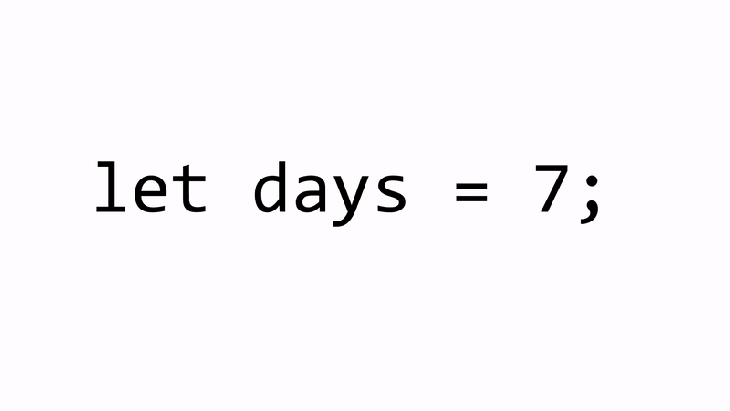

## Table of Contents
{: .no_toc .text-delta }

{: .fs-2 }
- TOC
{:toc}

---

## Variables & Data Types

Most of the time, a JavaScript application needs to work with **data** (information). Here are two examples:
1. An online shop - the information might include goods being sold and a shopping cart.
2. A chat application - the information might include users, messages, and much more.

In programming languages, a [variable](https://en.wikipedia.org/wiki/Variable_(computer_science)) is a "named storage container" for data. **Variables** are used to _store_ information.

<div class="imp" markdown="block">

- **DATA** is information 🧠
- **VARIABLES** store data → *like a **box*** 📦
- **IDENTIFIERS** are the names we give variables → *like a **label** on the box* 🏷️
- **DATA TYPES** are the categories of information → *like the **size/shape** of the box*
    
</div>

#### JS DATA TYPES
{:.no_toc}

| `Number` | 🔢 a **quantity/amount** that is either a **whole/integer** number or a **decimal/fractional** number |
| `String` | 🔤 a collection of **individual characters** (letters/numbers/symbols) that are “*strung together*” to form **text/words/sentences** |
| `Boolean` | either `true` or `false` |
| `Array` | a **list** of multiple values, each value has an **index** number that indicates its position/order in the collection  |
| `Object` | *custom* data types that hold a **group** of data, usually to represent a real-world object or an HTML document |

### Declaring Variables

To create (*declare*) a variable in JavaScript, use the `let` **keyword**.

<div class="imp" markdown="block">
    
The statement below **DECLARES** a new variable with the name "message":

```js
let message;
```

Now, store some data in it using the **ASSIGNMENT OPERATOR** `=`:

```js
message = 'Hello';
```

⭐️ **DECLARATION** + **ASSIGNMENT** can be combined into _one statement_:

```js
let message = 'Hello';
```

</div>

📦 We can **visualize** the concept of a variable if we imagine it as a "box" for data, with a uniquely-named "label" stuck on it for easy retrieval. 

For instance, the variable `message` can be imagined as a box labelled `"message"` with the value `"Hello!"` packed in it: 


<div class="warn" markdown="block">

A new variable can be **DECLARED** only once! A repeated declaration of the same variable triggers an error:

```js
let word = "This";

// Repeated 'let' declaration leads to error!!!
let word = "That"; // SyntaxError
```

So, we should declare a variable _once_, and then afterwards, only refer to it without the `let` keyword.

</div>

#### Working with Variables
{:.no_toc}

After declaring a variable, the **value** is now _saved_ into the memory area associated with the **variable**. So from now on, we can **ACCESS** that value using the variable name: 

```js
console.log(message); // shows the variable content
```

We can also **CHANGE** the value of a variable as many times as we want:

```js
let status = "Crashed Out";
status = "Locked In"; // value changed
console.log(status);
```

Whenever a value is modified, the old data is **removed** from the variable:


We can also declare two variables and **COPY DATA** from one into the other:

```js
let lunch = "Pizza";
let dinner;

// Copy the string from hello into message
dinner = lunch;

// Now both variables hold the same data
console.log(lunch);
console.log(dinner);
```

{:.highlight}
In older scripts, you may also find another **keyword** for declaring variables: `var message = 'Hello';` The `var` keyword is *almost* the same as `let`. It also declares a variable but in a slightly different, "old-school" way. 
> There are subtle differences between `let` and `var`, but they do not matter to us yet. 


#### Truck Ramp analogy for the Assignment Operator
{:.no_toc}

<iframe width="560" height="315" src="https://www.youtube.com/embed/cXUWYZXru6o?si=sB54GV-STb2ipVhL" title="YouTube video player" frameborder="0" allow="accelerometer; autoplay; clipboard-write; encrypted-media; gyroscope; picture-in-picture; web-share" referrerpolicy="strict-origin-when-cross-origin" allowfullscreen></iframe>

{:.highlight}
**VARIABLES** are containers for *carrying values* within your script, and the **assignment operator**, or `=` sign, is NOT an “equals sign” like in math equations → it’s more like **a ramp that loads up** a value. 

Using the [truck ramp analogy](https://blog.codeanalogies.com/2017/12/20/a-visual-guide-to-understanding-the-sign-in-javascript/), **DECLARING** a variable works like this:



> - The statement above creates a new truck called `days` that can "_drive_" around your script and "_deliver_" its **value** OR even pick up a new **value**. Breaking down the statement:
>     - `let` announces that you are creating a new variable ("_buying a new truck_").
>     - The variable needs a unique **name**, which is `days` here. This distinguishes this truck from all the other trucks.
>     - The **assignment operator**, or `=` sign, "_loads_" the **value** `7`, into the `days` truck
> - The variable `days` is not “equal” to anything! It merely *carries* around the value that you assign to it.
> - In JS, unlike math, you can simply **RE-ASSIGN** a new value to the variable later. For example:
>     - `days = 5;` → the assignment operator _loads_ a new value on to the `days` truck

Using the [truck ramp analogy](https://blog.codeanalogies.com/2017/12/20/a-visual-guide-to-understanding-the-sign-in-javascript/), passing a variable into **FUNCTIONS** works like this:
    


<div class="task" markdown="block">

Complete the **Variables** section (steps 1-6) in the following _interactive tutorial_: 
[🏗️ JS Construction Site](https://www.codeanalogies.com/jsconstruction/)

</div>

### Arithmetic Operators

The following math **operations** are supported:

- Addition `+`,
- Subtraction `-`,
- Multiplication `*`,
- Division `/`,
- Remainder `%`,
- Exponentiation `**`.

The first four are straightforward, while `%` and `**` need a few words about them.

#### Remainder `%`
{:.no_toc}

The **remainder operator** `%`, despite its appearance, is not related to percents.

The result of `a % b` is the [remainder](https://en.wikipedia.org/wiki/Remainder) of the integer division of `a` by `b`.

```js
console.log( 5 % 2 ); // 1, the remainder of 5 divided by 2
console.log( 8 % 3 ); // 2, the remainder of 8 divided by 3
console.log( 8 % 4 ); // 0, the remainder of 8 divided by 4
```

#### Exponentiation `**`
{:.no_toc}

The **exponentiation operator** `a ** b` raises `a` to the power of `b`.
> In school math, we write that as: a<sup>b</sup>.

```js
console.log( 2 ** 2 ); // 2² = 4
console.log( 2 ** 3 ); // 2³ = 8
console.log( 2 ** 4 ); // 2⁴ = 16
```

Just like in math, the exponentiation operator is defined for non-integer numbers as well.

For example, a square root is an exponentiation by ½:

```js
console.log( 4 ** (1/2) ); // 2 (power of 1/2 is the same as a square root)
console.log( 8 ** (1/3) ); // 2 (power of 1/3 is the same as a cubic root)
```

### String Concatenation

Let's meet the features of JavaScript operators that are beyond school arithmetics.

Usually, the plus operator `+` sums numbers. But, if the binary `+` is applied to `strings`, it **concatenates** (_merges_) them:

```js
let s = "my" + "string";
console.log(s); 
```

Note that if any of the operands is a string, then the other one is **converted** to a string too. For example:

```js
console.log( '1' + 2 ); // "12"
console.log( 2 + '1' ); // "21"
```
> See, it doesn't matter whether the first operand is a string or the second one.

Here's a more complex example:

```js
console.log(2 + 2 + '1' ); // "41" and not "221"
```
> Here, operators work one after another. The first `+` sums two numbers, so it returns `4`, then the next `+` adds the string `1` to it, so it's like `4 + '1' = '41'`.

### Increment/Decrement

Increasing or decreasing a number by one is among the most common numerical operations.

So, there are special operators for it:

- **Increment** `++` increases a variable by 1:

    ```js
    let counter = 2;
    counter++; // works the same as counter = counter + 1, but is shorter
    console.log( counter ); 
    ```
- **Decrement** `--` decreases a variable by 1:

    ```js
    let counter = 2;
    counter--; // works the same as counter = counter - 1, but is shorter
    console.log( counter );
    ```

{:.warning}
Increment/decrement operators can only be applied to **variables**. Trying to use it on a _value_, like `5++`, will give an error.

---

## Functions

Quite often we need to perform a **similar action or process** in _multiple places_ of the script. 
> For example, we need to show a nice-looking message when a visitor logs in, logs out and maybe somewhere else. Or for a game, a random number needs to be generated over and over again for loot picks. 

**Functions** are the main "building blocks" of a program – they allow blocks of code to be called many times without too much repetition.

<html>
<dl>
<dt>Function</dt>
<dd>A <em>reusable</em> set of <strong>code statements</strong> that accomplish a specific task in a certain way.</dd>
</dl>
</html>

<div class="imp" markdown="block">
    
📝 `console.log` is a built-in **function** that **displays** data by *logging* information in the console. Here's an example of **using** (_calling_) that function in a statement:

```js
console.log("Hello World!");
```

- Inside the **parenthesis** `()` goes the data to be displayed. Options:
    - 💬 Indicate `String` data by surrounding the text with **quotations** (`""`)
    - `Number` or `Boolean` type data can be entered directly (`3.14`, `7`, `true`)
    - Can also "_pass in_" **expressions** or **variables**

</div>

### Declaring Functions

To **create** a function we can use a *function declaration*.

It looks like this:

```js
function showMessage() {
  console.log('Hello everyone!');
}
```

<div class="imp" markdown="block">
    
When **DECLARING** a function:
1. The `function` keyword goes first
2. Then put the **name** of the function
3. Then a possible list of **parameters** between the *parentheses* (comma-separated, empty in the example above)
4. Finally the **code** of the function (called the "function body") goes between _curly braces_.

```js
function name(parameter1, parameter2, ... parameterN) {
    // body
}
```

</div>

As seen above with the `console.log();` example, a function can be **CALLED** (_activated/run_) by its name.
> The call `showMessage();` executes the code inside the `showMessage` function. We can call this as many times as we want!

If we ever need to change the message or the way it is shown, it's enough to modify the code in one place: the **function** which handles it.

#### Function Naming
{:.no_toc}

Functions are **actions**. So their name is usually a _verb_. It should be brief, as accurate as possible and describe what the function does, so that someone reading the code gets an indication of what the function does.

- A name should clearly describe what the function _does_. When we see a function call in the code, a good name instantly gives us an understanding what it does and returns.
- There exist many well-known function **prefixes** like `create…`, `show…`, `get…`, `check…` and so on. Use them to hint what a function does.

#### Parameters (Input)

We can _pass_ arbitrary **data** to functions using **parameters**.

In the example below, the function has two parameters: `from` and `text`:

```js
function showMessage(from, text) { 
  alert(from + ': ' + text);
}

showMessage('Ann', 'Hello!');
showMessage('Ann', "What's up?");
```

When the function is called, the given values are **copied** to local variables `from` and `text`. Then the function uses them.

When a value is passed as a function parameter, it's also called an *argument*. In other words, to put these terms straight:

<html>
<dl>
<dt>Parameter</dt>
<dd>The <strong>variable</strong> listed inside the parentheses in the function <em>declaration</em> (it's a declaration-time term).</dd>
<dt>Argument</dt>
<dd>The <strong>value</strong> that is passed to the function when it is <em>called</em> (it's a call-time term).</dd>
</dl>
</html>

We **declare** functions listing their _parameters_, then **call** them passing _arguments_.
> In the example above, one might say: "the function `showMessage` is declared with two parameters, then called with two arguments: `from` and `"Hello"`".

#### Return (Output)

A function can **return** ("_output_") a value back into the calling code as the result.

The simplest example would be a function that sums two values:

```js
function sum(a, b) {
  return a + b;
}

let result = sum(1, 2);
console.log( result );
```

> The directive `return` can be in any part of the function, but typically at the end. When the execution reaches it, **the function stops**, and the value is returned as a _new piece of data_ to the calling code (assigned to `result` above).

{:.warning}
🚫 Never add a new line between `return` and the **value**!!! For a long expression in `return`, it might be tempting to put it on a separate line, but it doesn't work.

#### RECIPE ANALOGY FOR FUNCTIONS
{:.no_toc}

Functions can be **visualized** as _recipes_ for different actions/processes in your script.

{:.highlight}
For a more in-depth description of the **recipe analogy** below, check out this blog post: [JavaScript Functions Explained by Making a Recipe](https://www.codeanalogies.com/javascript-functions-explained#javascript)

Let's think about the general concept of **cooking with a recipe** first. Using a recipe means that:

1. You start with a specific set of ingredients
2. You perform a specific procedure using those ingredients
3. You will get a reliable product at the end

- A **FUNCTION** is also a **reusable recipe** that performs the same set of actions over and over again on a set of ingredients.
- Those **ingredients** are called **PARAMETERS → “INPUT”**
- Some functions **RETURN** a value, which means that they ***give you a new value*** that you can then use throughout your script **→** “**OUTPUT”**


- Other functions **do not return** a value, instead, they might ***change a value that already exists*** in your script or carry out an action like `console.log()`
    - Think of it like chopping onions. There is no "new" product, just the same product in a new format.
    - Boiling water to make pasta is another example of a function that just “does/changes something” but doesn’t necessarily give you something new in return
    

    
- Check out the example below to see the general layout of a function. In this example, we are **DEFINING** **a function** (“documenting the recipe”) called `makeSandwich`.
    - It does **return** a value here: one full sandwich.
    - *Why is this useful in real life? Why is this useful in code?*
    

      

<div class="task" markdown="block">

Complete the **Functions** section (steps 16-20) in the following _interactive tutorial_: 
[🏗️ JS Construction Site](https://www.codeanalogies.com/jsconstruction/)

</div>


---

#### Acknowledgement
{: .no_toc }

Content on this page is adapted from the [MDN Web Docs](https://developer.mozilla.org/en-US/docs/Web/JavaScript/Guide), [The Modern JavaScript Tutorial](https://javascript.info/), and [CodeAnalogies Blog](https://www.codeanalogies.com/).
{: .fs-2 }
