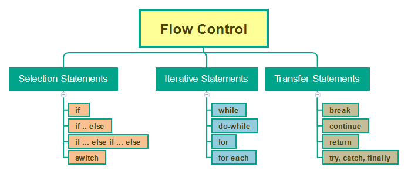

## Table of Contents
{: .no_toc .text-delta }

{: .fs-2 }
- TOC
{:toc}

---

## Program Control Flow


**Control flow** or flow of control is a fundamental concept that simply shows the _order_ in which your program’s code is being _executed_. 
> 📣 It's basically you dictating or telling your program’s code “Hey this is how I want you to run under various scenarios or conditions until a particular condition is being met”.
 
<html>
 <dl>
  <dt>Control Statements</dt>
  <dd>Structures of code that lets your code execute an action depending on the context of the scenario or condition.</dd>
 </dl>
</html>



{:.important}
**Flow control statements** affect the _execution order_ of **statements** or instructions in a program. They are often used to make _decisions_, _repeat_ blocks of code, and _jump_ to specific sections of code.

---

## Selection (Conditionals)

Sometimes, we need to perform different actions based on different **conditions**.

### Comparison Operators

We know many comparison operators from math, which can be used in code to write **conditional statements**. 

- Greater/less than: <code>a &gt; b</code>, <code>a &lt; b</code>.
- Greater/less than or equals: <code>a &gt;= b</code>, <code>a &lt;= b</code>.
- Equals: `a == b`, please note the double equality sign `==` means the equality test, while a single one `a = b` means an assignment.
- Not equals: In maths the notation is <code>&ne;</code>, but in JavaScript it's written as <code>a != b</code>.

### `if` Statements

<div class="task" markdown="block">

Complete **steps 7-14** in the following _interactive tutorial_: 
[🏗️ JS Construction Site](https://www.codeanalogies.com/jsconstruction/)

</div>

<!--

### "Truthiness"

When we use `if()` statements, we are not always going to be able to plug in a variable that already holds the **value** of `true` or `false`. Many times, we must plug in a **statement** that will be _evaluated_ by JavaScript as `true` or `false`.

For example, do you know if the value `0` is `true` or `false`?

This is not a philosophy question – JavaScript has an answer. This happens because JavaScript is a _weakly typed_ language. This means that in the context of an `if()` statement, it will convert other variable values to `true` or `false` in order to run the code. This is known as determining the “truthiness” of a value.

> This is similar to the legal system! Although it is POSSIBLE that there will be one piece of evidence that makes the “guilty” or “not guilty” sentence obvious, it is also likely that a judge or jury will need to _evaluate_ the evidence and make a decision.

For this analogy, let's assume a `true` statement is one that will lead to the conviction of the accused car theft, while a `false` statement will let him/her walk free. 

```js
let evidence = "Fingerprints";
 
if (evidence) {
  convict();
}
 
else {
  release();
}
```
> `convict()` and `release()` are made-up functions. In this case, since `evidence` has a non-zero/non-empty value, the `if()` statement _evaluates_ to `true`, so the judge would convict the car thief. 

Here’s an interactive diagram of this scenario:

<iframe src="https://blog.codeanalogies.com/wp-admin/admin-ajax.php?action=h5p_embed&id=19" width="680" height="322" frameborder="0" allowfullscreen="allowfullscreen" title="True Value in If Statement"></iframe><script src="https://blog.codeanalogies.com/wp-content/plugins/h5p/h5p-php-library/js/h5p-resizer.js" charset="UTF-8"></script>

-->

---

## Iteration (Looping)

### `while` Loops 

### `for...in` loops


---

#### Acknowledgement
{: .no_toc }

Content on this page is adapted from the [MDN Web Docs](https://developer.mozilla.org/en-US/docs/Web/JavaScript/Guide), [The Modern JavaScript Tutorial](https://javascript.info/), and [CodeAnalogies Blog](https://www.codeanalogies.com/).
{: .fs-2 }
